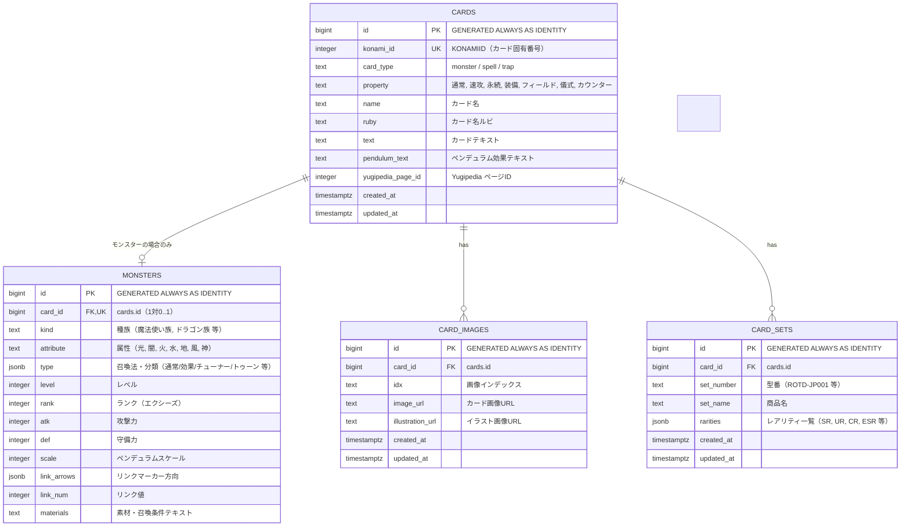

```mermaid
erDiagram
    CARDS {
        bigint id PK "GENERATED ALWAYS AS IDENTITY"
        integer konami_id UK "KONAMIID（カード固有番号）"
        text card_type "monster / spell / trap"
        text property "通常, 速攻, 永続, 装備, フィールド, 儀式, カウンター"
        text name "カード名"
        text ruby "カード名ルビ"
        text text "カードテキスト"
        text pendulum_text "ペンデュラム効果テキスト"
        integer yugipedia_page_id "Yugipedia ページID"
        timestamptz created_at
        timestamptz updated_at
    }
​
    MONSTERS {
        bigint id PK "GENERATED ALWAYS AS IDENTITY"
        bigint card_id FK,UK "cards.id（1対0..1）"
        text kind "種族（魔法使い族, ドラゴン族 等）"
        text attribute "属性（光, 闇, 火, 水, 地, 風, 神）"
        jsonb type "召喚法・分類（通常/効果/チューナー/トゥーン 等）"
        integer level "レベル"
        integer rank "ランク（エクシーズ）"
        integer atk "攻撃力"
        integer def "守備力"
        integer scale "ペンデュラムスケール"
        jsonb link_arrows "リンクマーカー方向"
        integer link_num "リンク値"
        text materials "素材・召喚条件テキスト"
    }
​
    CARD_IMAGES {
        bigint id PK "GENERATED ALWAYS AS IDENTITY"
        bigint card_id FK "cards.id"
        text idx "画像インデックス"
        text image_url "カード画像URL"
        text illustration_url "イラスト画像URL"
        timestamptz created_at
        timestamptz updated_at
    }
​
    CARD_SETS {
        bigint id PK "GENERATED ALWAYS AS IDENTITY"
        bigint card_id FK "cards.id"
        text set_number "型番（ROTD-JP001 等）"
        text set_name "商品名"
        jsonb rarities "レアリティ一覧（SR, UR, CR, ESR 等）"
        timestamptz created_at
        timestamptz updated_at
    }
​
    CARDS ||--o| MONSTERS : "モンスターの場合のみ"
    CARDS ||--o{ CARD_IMAGES : "has"
    CARDS ||--o{ CARD_SETS : "has"
```
