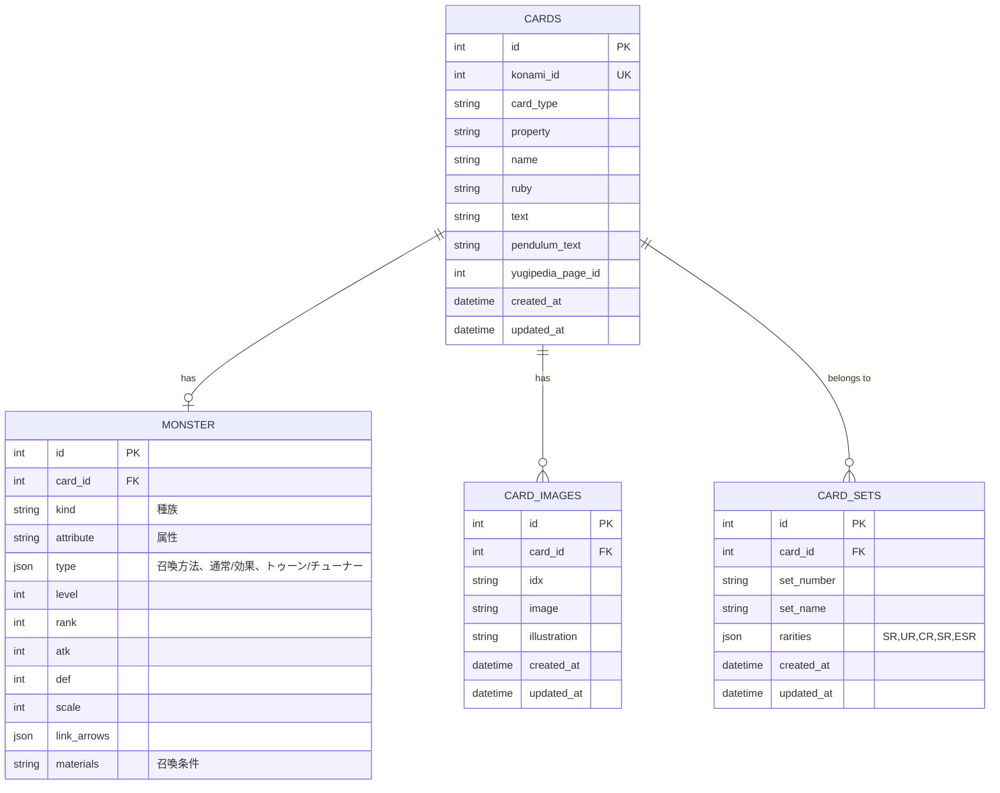

```mermaid
erDiagram
    CARDS {
        int id PK
        int konami_id UK
        string card_type
        string property
        string name
        string ruby
        string text
        string pendulum_text
        int yugipedia_page_id
        datetime created_at
        datetime updated_at
    }

    MONSTER {
        int id PK
        int card_id FK
        string kind "種族"
        string attribute "属性"
        json type "召喚方法、通常/効果、トゥーン/チューナー"
        int level
        int rank
        int atk
        int def
        int scale
        json link_arrows
        string materials "召喚条件"
    }

    CARD_IMAGES {
        int id PK
        int card_id FK
        string idx
        string image
        string illustration
        datetime created_at
        datetime updated_at
    }

    CARD_SETS {
        int id PK
        int card_id FK
        string set_number
        string set_name
        json rarities "SR,UR,CR,SR,ESR"
        datetime created_at
        datetime updated_at
    }

    CARDS ||--o| MONSTER : "has"
    CARDS ||--o{ CARD_IMAGES : "has"
    CARDS ||--o{ CARD_SETS : "belongs to"
```
